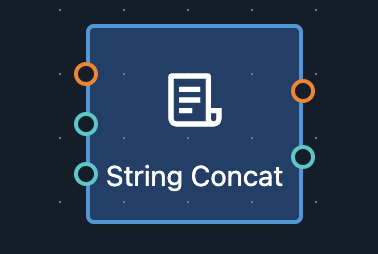
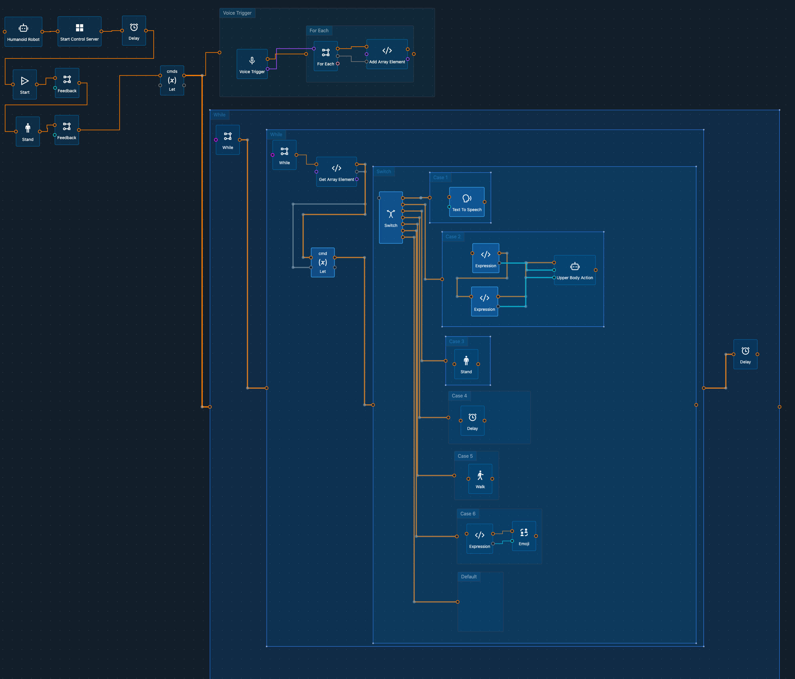

---

sidebar_position: 2

---

# Basic Concepts

## Data Flow and Control Flow

In Fourier Builder, workflows are constructed using a combination of data flow and control flow. 

- **Data Flow**: This refers to the movement of data between nodes. It connects the output of one node to the input of another, defining the sequence of node execution and the data exchanged between nodes.
  
- **Control Flow**: This manages the execution sequence of nodes, defining the order and conditions under which nodes are executed. Control flow enables the creation of loops, branches, and other control structures within the workflow.

Each node in Fourier Builder features input/output ports that are color-coded: Yellow for control flow and Green for data flow. A node waits for a trigger signal on the **Trigger** input port from the preceding node's **Done** output port. Once this trigger signal is received, the node executes, outputs data via its output ports, and sets its **Done** output port. This, in turn, triggers all the connected nodes through their **Trigger** ports.

Understanding these concepts is crucial for grasping how workflows are executed and how data is passed between nodes, forming the foundation of workflow construction in Fourier Builder.

## Node

Nodes are the fundamental building blocks of a workflow, each representing a single step or task. Nodes are connected to form a workflow and execute specific functions.

### Node Properties
- **Name**: The name of the node, displayed within the workflow.
- **Type**: The node's type, indicated by its icon.
- **Description**: A brief explanation of the node's purpose.
- **Input Ports**: Points where data enters the node.
- **Output Ports**: Points where data exits the node.
- **Attributes**: Configurable properties that customize the node's behavior. For instance, a function node's attributes might specify the function it executes.

A typical node looks like this:

## Edge

Edges represent connections between two nodes, defining the flow of data in the workflow. 

- **Data Flow Edge**: Green, indicating the flow of data.
- **Control Flow Edge**: Yellow, indicating the flow of control.

These edges ensure the proper execution sequence and data movement between nodes.

## Workflow

A workflow is a sequence of connected nodes, executed in a specific order to accomplish a given task. Workflows in Fourier Builder can be constructed and deployed to a robot to automate processes, perform data processing, or control robotic operations.

### Workflow Components
- **Event Receiver**: The workflow's entry point, determining how it is triggered (e.g., manual execution, external events like sensor readings, or timers).
- **Data Processing Nodes**: Nodes that manipulate data by filtering, transforming, or analyzing it.
- **Control Nodes**: Nodes that manage the flow of the workflow, such as branching, looping, or conditional execution.
- **Function Nodes**: Nodes that perform actions based on the workflow's results, like sending commands to a robot, saving data, or displaying information.

## Project

Projects serve as organizational units for grouping related workflows. Each project is automatically saved to the Fourier Builder cloud, ensuring access from anywhere with an internet connection. Projects facilitate collaboration by allowing workflows to be shared with others.

## Template

Workflows can be published as templates—reusable starting points for new workflows. Templates streamline workflow creation and can be shared, making it easier to rapidly develop new workflows.
