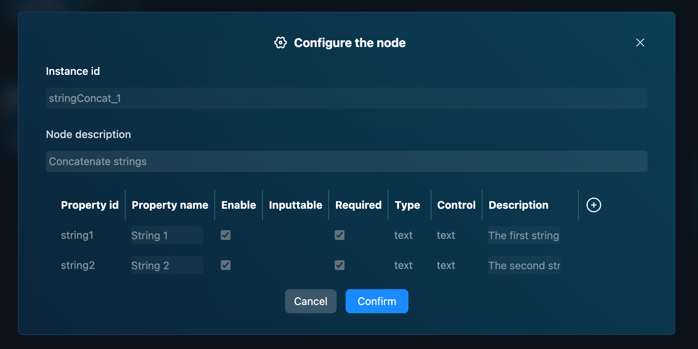

# UI

In this section, we provide a brief introduction to the Fourier Builder UI.

## Layout

The Fourier Builder UI is organized into several key sections:

1. **Project Tabs**: Multiple projects can be opened and edited simultaneously. You can also click the **Back** button on the left to return to the project list page or click the **New Project** button on the right to create a new project.
2. **Workflow Canvas**: This is where you build and edit your workflows.
3. **Node Pane**: Contains all the nodes available for constructing your workflow.
4. **Properties Pane**: Displays properties of the currently selected node.
5. **Simulation Pane**: Allows you to view robot simulations.
6. **Toolbar**: Located at the bottom, it contains buttons for common actions such as saving, deploying, and running workflows.

Let's delve into these important sections: Node Pane, Properties Pane, 

## Workflow Canvas

The workflow canvas is the main area where you create and edit workflows. You can drag and drop nodes from the node palette onto the canvas to construct a workflow. Connect nodes by dragging an edge from the output of one node to the input of another.

You can pan the canvas by clicking and dragging, and zoom in or out using the mouse wheel. The canvas also includes a minimap in the bottom right corner for easy navigation.

Pressing down the left mouse button and dragging will select nodes. Pressing down the right mouse button and dragging will pan the canvas. Scrolling the mouse wheel will zoom in or out. You can also use the zoom buttons in the toolbar.

## Node Pane

The node palette contains all the nodes you can use to build your workflow. By default, the palette is collapsed; you can expand it to select nodes for your workflow. Use the Pin button to keep it always visible for convenience, although this will reduce the editing space.

Nodes are organized into categories. Click on a category to view its nodes, or use the search bar to find specific nodes.

If necessary you can extend the nodes list with your custom node definitions. This feature is publicly available yet, you can [Submit a Request](https://github.com/tiwater/luban-docs/issues/new) if necessary.

## Property Pane

When you select a node on the canvas, the properties panel displays its properties. If the node has extended properties, a Configure the node button will appear. Clicking this button opens the Node Configuration dialog for further customization.

## Simulation Pane

The Simulation panel is part of the Properties Panel. By selecting the Simulation tab, you can enable the simulation feature and run the workflow on a simulated robot. We currently integrate Webots as the simulation engine, allowing you to see the robot moving and interacting with its environment in real-time.

## Toolbar

The toolbar contains buttons for common actions like saving, deploying, and running workflows. From left to right, the toolbar includes:

### Editing functions

- **Copy**: Copy the currently selected nodes to the clipboard.
- **Paste**: Paste nodes from the clipboard onto the canvas (if applicable).
- **Undo**: Undo the last action.
- **Redo**: Redo the last action.
- **More Actions**: Access additional editing options such as project settings.

### Running functions

- **Run**: Execute the workflow from the builder, useful for testing.
- **Deploy**: Deploy the workflow to the robot, enabling it to run on the physical device.

### View functions

- **Zoom In**: Increase the canvas zoom level.
- **Zoom Out**: Decrease the canvas zoom level.
- **Fit**: Adjust the canvas to fit the window.
- **Minimap**: Toggle the minimap on the canvas, useful for navigating large workflows.

The Fourier Builder UI provides a comprehensive and intuitive platform for constructing and managing robotic workflows. With its organized layout and versatile tools, users can efficiently create, simulate, and deploy complex workflows. Each section of the UI, from the Workflow Canvas to the Simulation Panel, is designed to streamline the development process and enhance productivity.