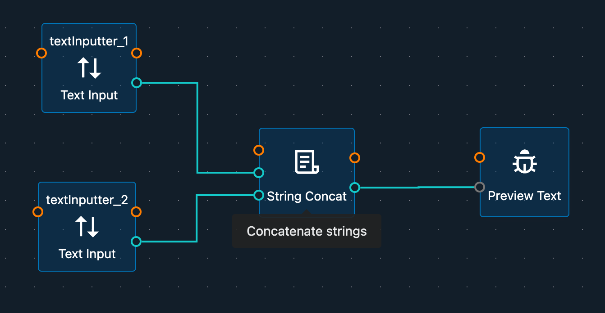
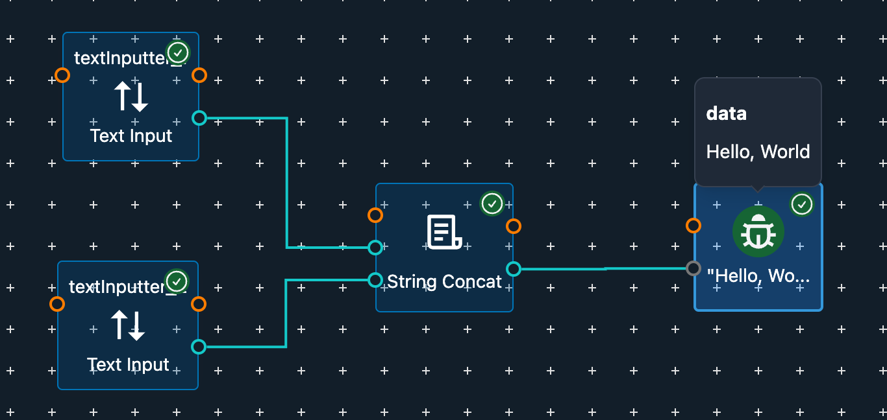

# First Workflow

After creating your new project, you are ready to customize and build your first workflow. In this section, we'll walk you through building a simple "Hello World" workflow.

## Build Workflow

In the blank Workflow Editor, you can start by adding nodes and connecting them to create your workflow. The goal is to make the workflow look like the one shown below:

In this simple workflow, you only need to connect the data ports of the nodes (marked in green). These connections will be enough to drive the workflow since data will flow through these ports from one node to the next.

## Run Workflow

Once you have built your workflow, you can run it within the developer environment. To do this, click the **Run** button located at the bottom center of the Workflow Editor.

When the workflow starts running, you will notice a change in the background of the Workflow Editor. Each node will display its status in the top right corner, and the data flow between nodes will be visualized. Hovering your mouse over a data port will show the data flowing through it. Additionally, moving your mouse over the icon of the Preview Text node will let you see the full text received by that node.

These visual indicators confirm that your workflow is running successfully.

Although this "Hello World" workflow does not perform any practical function, it is a great starting point to help you understand how to build and run workflows in Fourier Builder. You can further customize and expand this workflow by adding more nodes and actions to achieve your desired robot behavior.