# Workflow for Robot

In the previous workflow, we built a simple "Hello World" sequence. In this section, we will develop a more complex workflow where a humanoid robot listens, thinks, speaks, and acts.

## Workflow Overview

The workflow consists of the following steps:

1. **Start**: Begin with initialization for the simulation.
2. **ASR**: An Automatic Speech Recognition node acts as a trigger node.
3. **Event Loop**: Event loop listens for events triggered by ASR.
4. **Event Processing**: Handles the received events accordingly. In this example, it provides a response to the user's question using an LLM and executes fixed actions: move forward for two seconds and then move backward for two seconds.

## Build Workflow

1. **Create New Project**: Click the `New Project` button to create a new project.
2. **Edit Project Description**: Click the pop-up menu at the bottom of the editing area, select `Edit Description`, and customize the project description as needed.
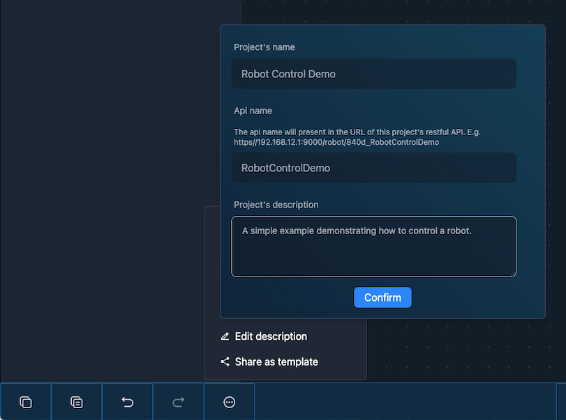
3. **Add Nodes**: Follow the steps below to add the corresponding nodes to the workflow and configure them as necessary:
     1. **Initialization**：Add the nodes below:
         - **Humanoid Robot Node** (Robot Control): Represents the robot entity, configuring the robot's IP for control.
         - **Boolean Input Node** (Input & Output): Determines whether the workflow runs on the real robot or in simulation.
           - Select the Boolean Input Node, press the `Configure the node` button in the Property Pane, change the `Instance id` to `simulationControl`, and click `Confirm` button.
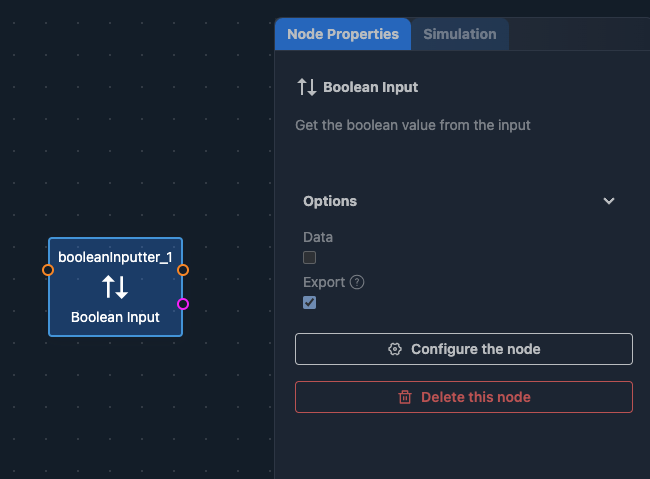
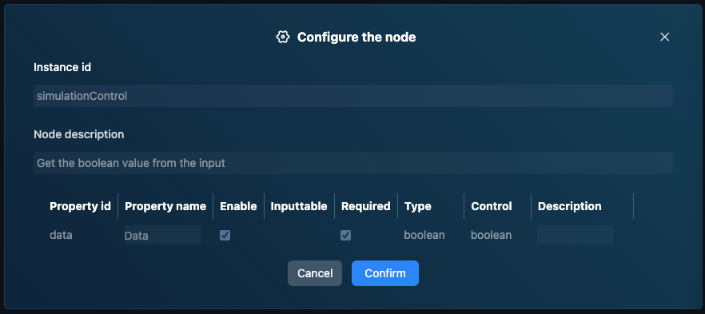
         - **If Node** (Logic Control): Controls the initialization process. Drag the following nodes into the True block of the If Node:
           - **Start Control Server Node** (Robot Management): Starts the robot control service.
           - **Start Node** (Robot Control): Initializes the robot driver.
           - **Delay Node** (Programming): Waits for initialization completion.
           - **Stand Node** (Robot Control): Commands the robot to stand.
           - **Delay Node** (Programming): Waits for the robot to complete standing.
           - For both Delay Nodes, input 5000 in the Time box in the Property Pane, indicating a 5-second delay (5000ms) to wait for command completion.
           - Connect the nodes in the True block of the If Node sequentially with the brown Trigger connections to define execution order.
         - Use brown Trigger connections to link the Humanoid Robot Node, Boolean Input Node, and If Block sequentially.
         - Connect the pink endpoints of the Boolean Input Node (simulationControl) and the If Node to pass the simulationControl boolean value as an input for conditional judgment.
        The current workflow should resemble the diagram below:
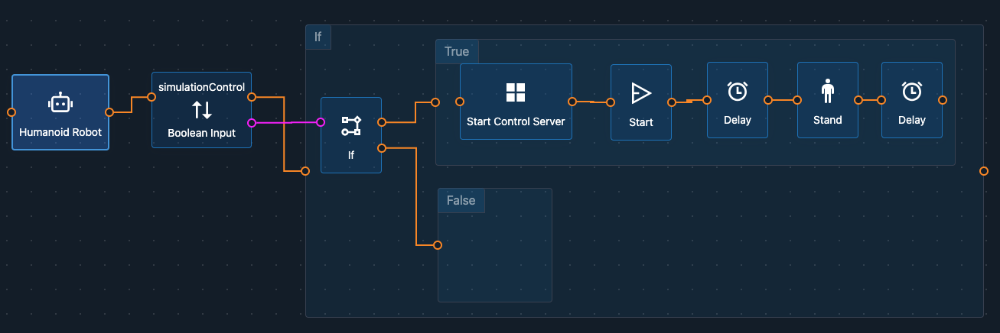
     2. **Configure Variables**:
         - Click the pop-up menu at the bottom of the editing area, select `Define variables`, input `events`, and click the `+` button, creating a variable for event queue. 
         - Then input `event` and click the `+` button, which will hold the current event being processed.
     3. **Trigger**: Add the nodes below:
         - **Let Node** (Programming): Assigns a value to a variable. In the Property Pane, select `events` in the `Variable` field and input `[]` in the `Value` field to initialize events as an empty array.
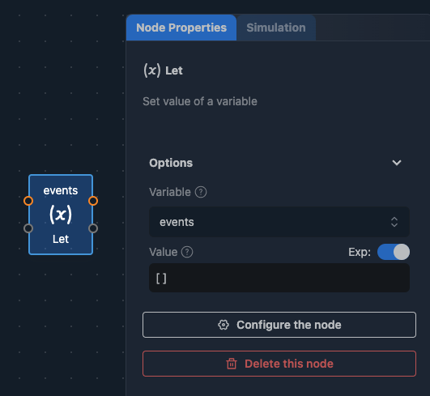
         - **ASR Node** (Interaction): Automatic Speech Recognition converts speech to text, triggering robot actions. Add the following nodes to the ASR block:
           - **For Each Node** (Logic Control): Iterates over the ASR output event array, processing each element. Add the following node to the For Each block:
             - **Add Array Element Node** (Programming): Adds elements to the array. Input `events` in the `Input Array` field to append the received object to the end of events.
         - Connect the Let, ASR, For Each, and Add Array Element nodes sequentially using the same color input-output ports, as shown below:
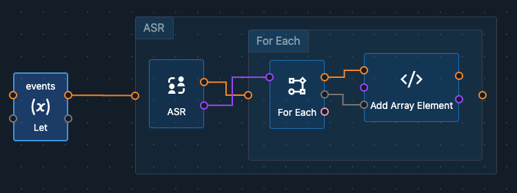
     4. **Main Message Loop**:
         - **While Node** (Logic Control): Select the While Node, input `true` in the `Condition` field of the Property Pane to create an infinite loop for the main message loop.
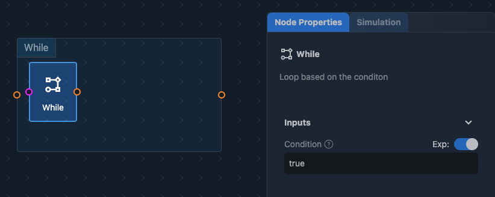
            Add the following nodes to the While block:
           - **While Node**: Select the inner While Node, input `events.length>0` in the `Condition` field of the Property Pane. This follows JavaScript syntax, processing events when the queue is not empty.
           - **Delay Node** (Programming): Input 100 in the Time field.
           - Connect the nodes in the inner While block to the outer While Node and the Delay Node as shown below:
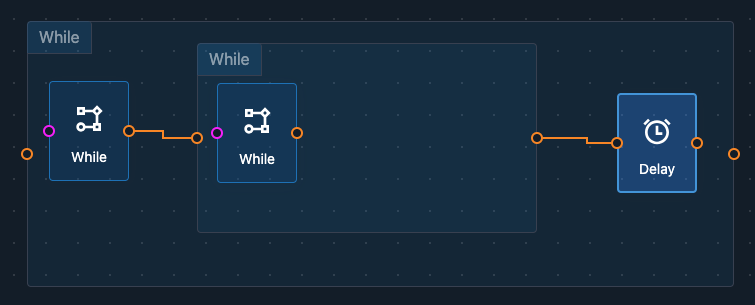
           - Add the following nodes to the inner While block:
             - **Get Array Element Node** (Programming): Takes elements from the array. Input `events` in the `Input Array` field and check the `Remove` box to remove processed events.
             - **Let Node** (Programming): Assigns values to variables. In the Property Pane, select `event` in the `Variable` field.
             - **Switch Node** (Logic Control): Handles messages, triggering different logic based on message type. Select the Switch Node, input `event.name` in the `Condition` field, and input `asr` in Case 1. If the event's name is asr, it triggers the logic in Case 1.
             - Connect the inner While Node with the Get Array Element Node, Let Node, and Switch Block sequentially as shown below:
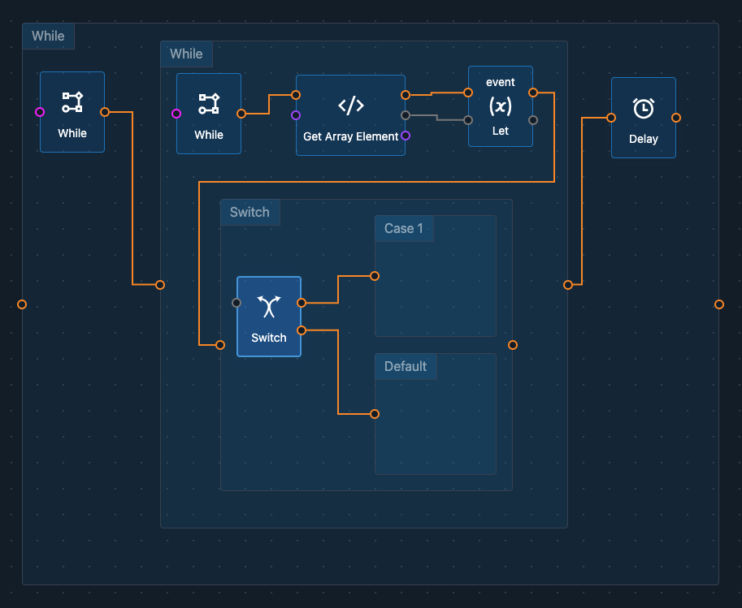
               - Add the following nodes to the Case 1 block of the Switch:
                 - **LLM Node** (AI): Large Language Model handles the user's text input. Enable the `Exp` option next to `Question` and input `event.parameters.text` in `Question` to allow the LLM to respond to the ASR Node’s recognized text. Adjust System Context as needed.
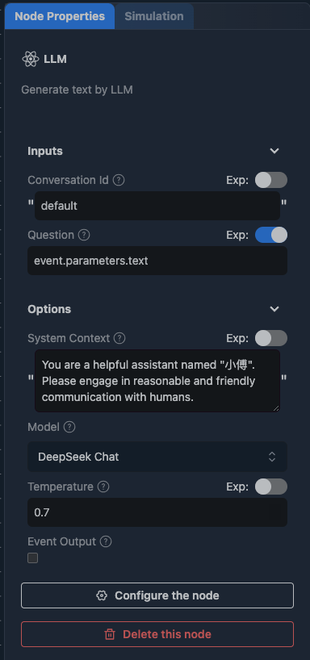
                 - **Text To Speech Node** (Interaction): Converts text to speech allowing the robot to vocalize the LLM's response. Customize the voice, speed, etc.
                 - **Walk Node** (Robot Control): Controls the robot's movement.
                 - **Delay Node** (Programming): Waits for the robot to move. Set Time to 2000 (2 seconds).
                 - **Walk Node** (Robot Control): Moves the robot with `Speed` set to -0.1 (backward motion).
                 - **Delay Node** (Programming): Waits for the robot to move. Set Time to 2000 (2 seconds).
                 - **Stand Node** (Robot Control): Commands the robot to stand.
                 - Connect the nodes as illustrated below:
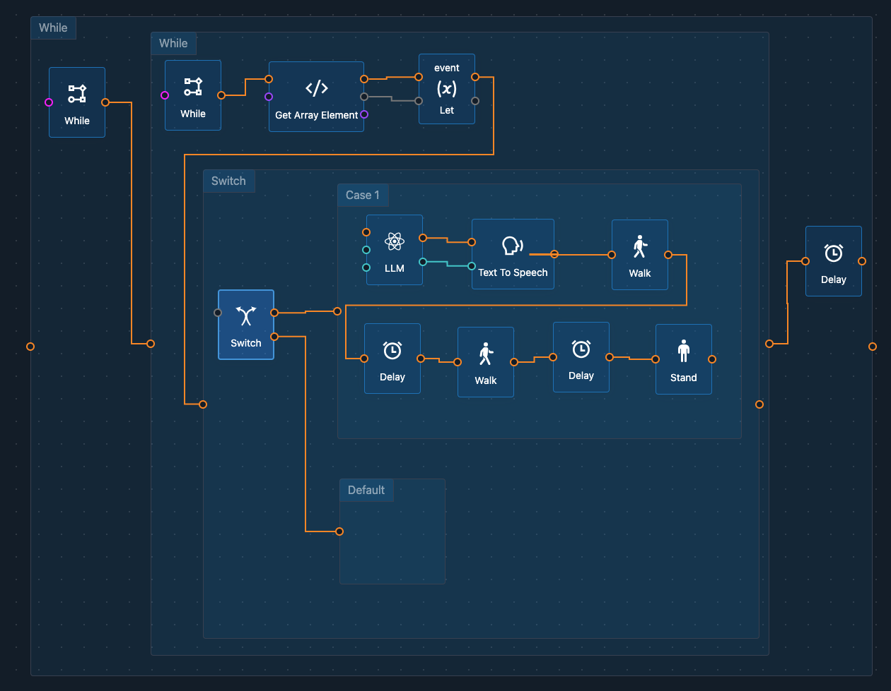
     5. **Simulation Trigger**：
         - To test robot movements in the simulation since ASR Node cannot run in a simulated environment, let's simulate the trigger condition. Add the following nodes to the workflow:
         - **If Node** (Logic Control): Add the following nodes to the True block of the If Node:
           - **Let Node** (Programming): Assigns values to variables. In the Property Pane, select `events` in the `Variable` field and input `[{"name":"asr","parameters":{"text":"Hi, nice to meet you!"}}]` in the `Value` field to simulate ASR detecting human conversation.
     6. **Final Assembly**:
         - Connect the node groups created in previous steps in approximately the following sequence: i -> iii -> iv -> v using brown Trigger connections.
         - Note: Connect the If block of the group v to the Let Node of the group iii; connect the pink input port of the If Node in the group v to the output port of the Boolean Input in the group i. The final setup should look like this:
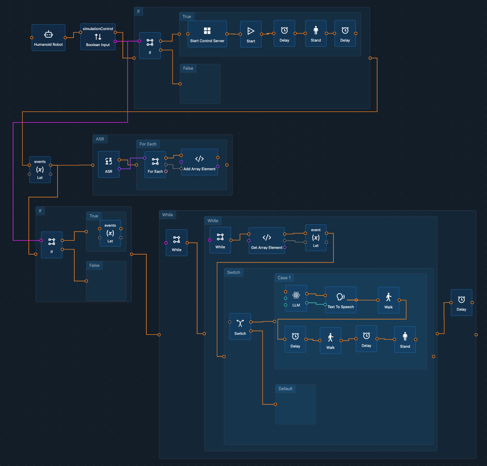

## Test Workflow with Simulation

Simulation is an important feature for robot development. It allows you to test your workflow without deploying it to the robot. You can see how the robot moves and interacts with its environment in real-time. It's not only convenient but also safe. Sometimes flawed program can cause damages to the robot, simulation can help you avoid this risk. Or unexpected robot behavior will cause accident such as hurting people, simulation can help you avoid this risk.

1. **Config Workflow for Simulation**: Select the `simulationControl` (Boolean Input) node, check the `Data` option in the `Properties Pane` enabling the workflow to execute the simulation branch.
   
2. **Enable Simulation**: Click the `Simulation` tab in the `Properties Pane` to enable the simulation feature, and then click the **Turn on simulation** button to start the simulation. Please wait for a moment, the simulation environment will be loaded.

3. **Run Workflow**: Click the `Run` button to run the workflow in the simulation environment. You will see the robot moving forward and backward in the simulation.

Since the simulation doesn't support interactive features beyond movement, only basic robot movements are visible. In a real environment, the robot moves as expected and can listen and talk. Testing these features on the real robot is safe and straightforward.

## Next Steps

Now we have a workflow that commands the robot to move forward and backward. In the next section, we will deploy the workflow to the robot and run it in a production environment.

**Note**:
Before executing on the robot, deselect the `Data` option of the `simulationControl` (Boolean Input) node.