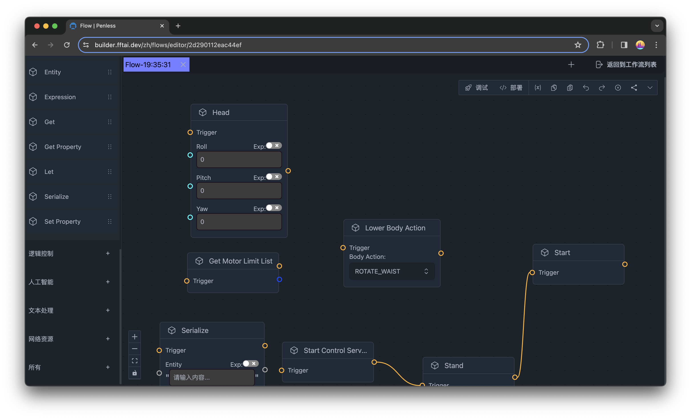

# Run Workflow

To run workflow, we can run in the deveoper environment, or run in the production environment after deploying the workflow to robot.

## Run in Developer Environment

To run the workflow in the developer environment, you can click the `Run` button in the top right corner of the workflow editor.

## Deploy and Run in Production Environment

To deploy the workflow to the robot, you can click the `Deploy` button in the top right corner of the workflow editor.

After deploying the workflow to the robot, you can run the workflow in the robot by clicking the `Run` button in the top right corner of the workflow editor.

Now let's deploy the workflow to the robot and run it in the robot with the robot control app. The control app can be either a joystick or an Android phone with the Fourier Robot Control app installed.

After deploying the workflow to the robot, you can run the workflow in the robot by clicking the `Run` button in the top right corner of the workflow editor.