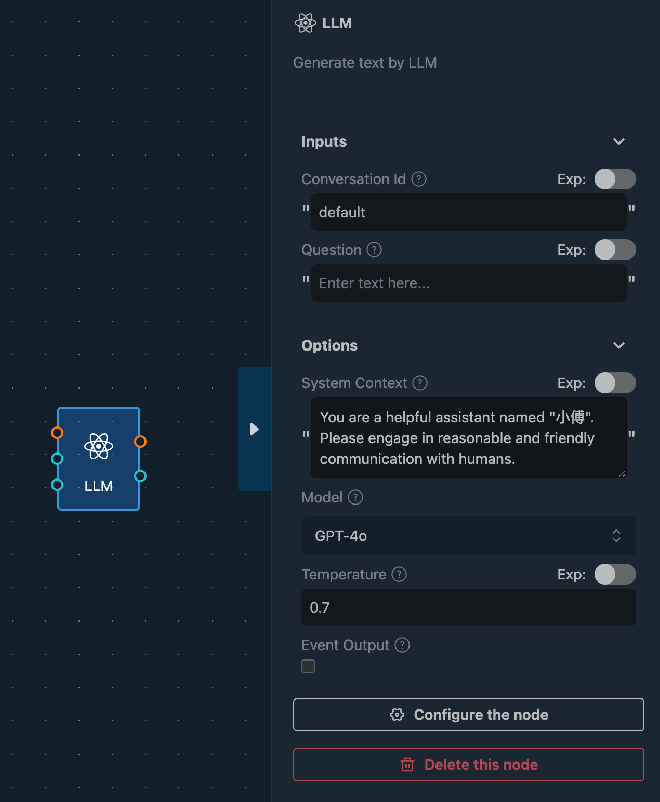
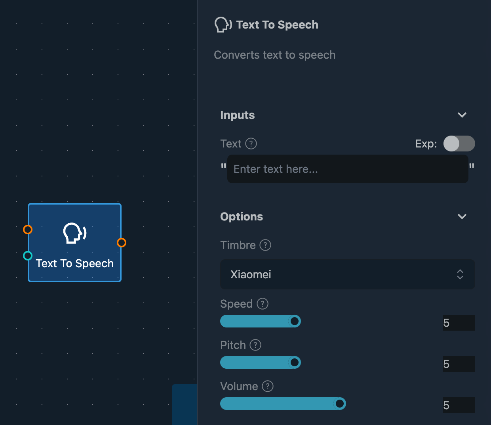
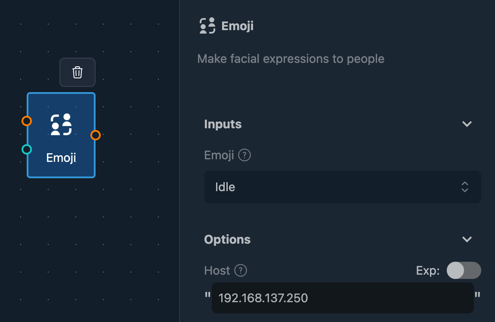

# Chat with AI

This guide will show you how to chat with AI using the `ai-chat` command effectively.

## Integrate with LLM

To chat with AI, you first need to integrate with a Large Language Model (LLM). Fourier Builder provides an easy way to achieve this using the **LLM and OpenAI node**.

### Supported AI Models

The LLM node supports several mainstream AI models, each with distinct characteristics and advantages. You can choose the appropriate model based on your requirements.

| Model | Text | Image | Provider |
| --- | --- | ---| ---|
| GPT-4o | ✅ | ✅ | OpenAI |
| GPT-3.5-Turbo | ✅ | ⭕ |  OpenAI |
| GPT-4-Turbo | ✅ | ⭕ |  OpenAI |
| ChatGLM-Turbo | ✅ | ⭕ |  Zhipu |
| ERNIE-Bot 4 | ✅ | ⭕ |  Baidu |
| DeepSeek Chat | ✅ | ⭕ |  DeepSeek |

We continuously add more AI models to this list. If you have specific requirements, please let us know.

## Voice Recognition

Voice recognition support is coming soon, allowing for even more interactive conversations with AI.

## Text to Speech

After receiving the AI's response, you can use the **Text To Speech** node to convert text into speech, enhancing the interaction with audible responses.

## Emoji

Unlike general chatbots, humanoid robots can use emojis to emphasize emotions, making the conversation more engaging. For example, including a happy emoji can make a joyous response more lively.

To utilize emojis, the robot needs a display screen to act as its face. Once the display is in place, Fourier Builder provides a simple method to display emojis using the **Emoji** node.

### Extensible Emoji Library

The emoji library is designed to be extensible, allowing you to add custom emojis to the system. This feature is not publicly available yet, but you can [Submit a Request](https://github.com/tiwater/luban-docs/issues/new) if needed.
