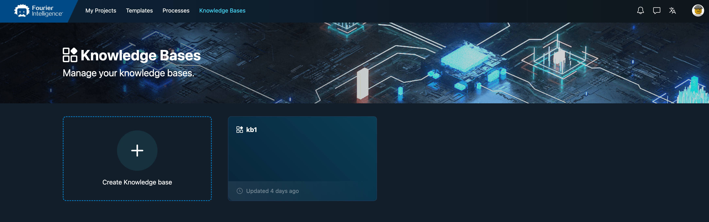
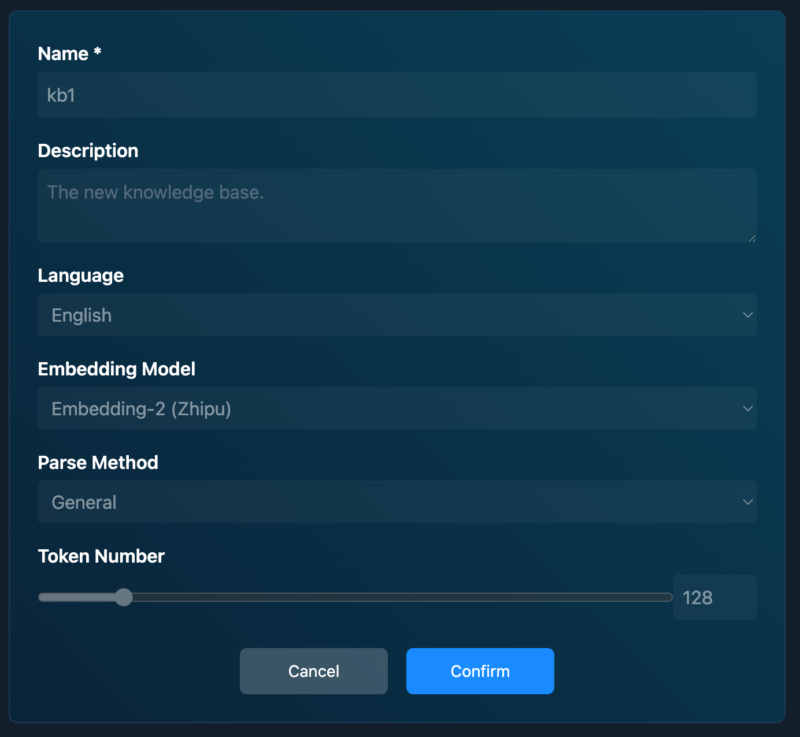
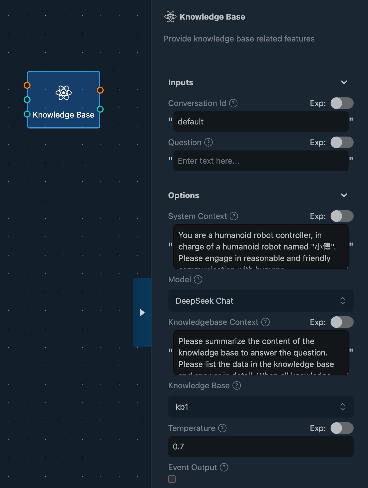

# Extend Knowledge

## Introduction

While Large Language Models (LLMs) are exceptionally powerful at answering general questions, they lack the specific knowledge required for certain domains that involve proprietary or private information. To enable robots to answer domain-specific questions, it is crucial to augment the LLM with a knowledge base.

For this purpose, Fourier Builder provides a simple method to integrate with a knowledge base using the Knowledge Base node.

## Preparing a Knowledge Base

Before utilizing the Knowledge Base node, you must first prepare your knowledge base. A knowledge base is a repository of facts, rules, and concepts designed to answer specific questions. You can create this repository by adding relevant facts and rules.

In Fourier Builder, you can create a knowledge base by adding these facts and rules. The steps are straightforward:

1. Navigate to [Fourier Builder Knowledge Bases](https://builder.fftai.dev/knowledgebases).
2. Create a new knowledge base and populate it with pertinent facts and rules.

On the knowledge base's detail page, you can configure various elements to optimize its functionality.

## Building Knowledge Bases

Once a new knowledge base is created and configured, you can enrich it by uploading relevant documents. The system will automatically extract pertinent information from these documents and integrate it into the knowledge base.

### Supported Document Formats
- PDF
- DOCX
- TXT
- HTML

## Using the Knowledge Base

After building your knowledge base, you can leverage the Knowledge Base node within your workflows to perform queries. The Knowledge Base node processes the query and fetches the appropriate answers from the knowledge base.

### Configuration
In the Properties Pane of the Knowledge Base node, you can select the specific knowledge base you want to query.

Using the Knowledge Base node in workflows is similar to using the LLM node, albeit slightly more complex. Simply input your question into the Knowledge Base node, and it will return the relevant answer based on the information stored in the knowledge base.